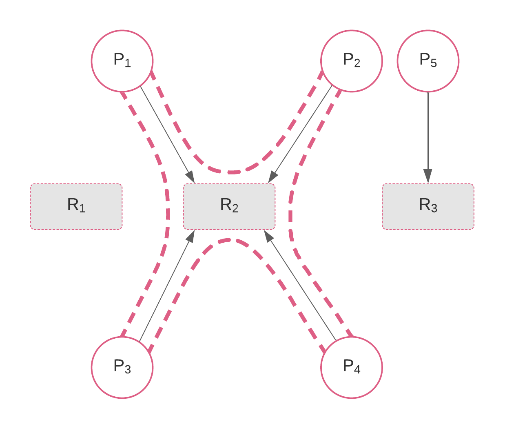

- (_Bloqueo mutuo / Deadlock_) $$\bullet$$ Cuando dos o más procesos se mantienen indefinidamente a la espera de usar un recurso compartido o comunicarse con otro proceso que, a su vez, también está a la espera. Este es un problema clásico de los sistemas concurrentes; el cual puede resolverse evitando la simetría entre procesos.
- Véase la figura de abajo para el siguiente ejemplo. Supongamos que tenemos cinco procesos $$P_1, ..., P_5$$, de ellos, los primeros cuatro intentan acceder a un mismo recurso $$R_2$$ produciendo un bloqueo mutuo; en cambio, el proceso $$P_5$$ no tiene conflicto en acceder al recurso $$R_3$$ porque ningún otro proceso lo está intentando acceder.
- Para una visión histórica, véase:
	- Coffman, E. G., et al. “System Deadlocks.” ACM Computing Surveys, vol. 3, no. 2, June 1971, pp. 67–78. DOI.org (Crossref), doi:10.1145/356586.356588.
- 